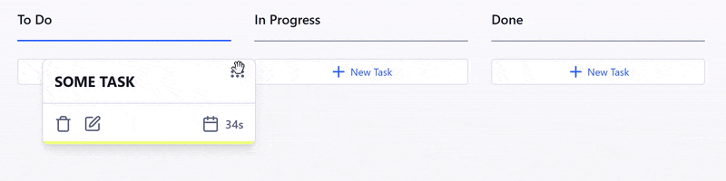

# 📋 Scrum Board Demo

A simple **Scrum Board** demo project built with pure **RTC P2P**, no backend.  
Supports both **online** and **offline** modes, with synchronization.  

---

## ✨ Features

- ✏️ Create and edit tasks in real time  
- 🔄 Full offline mode
- 👥 Invite and join members via link or QR code  
- 📋 Simple Scrum board interface  

---

## ⚙️ Tech Stack

- **Next.js**
- **TailwindCSS**
- **Peer.js** — WebRTC
- **PWA**
- **IndexedDB / LocalStorage** — offline task storage  

---

## Links

- [uikit](https://uikit-peach.vercel.app)
- [GitHub](https://github.com/belousovjr/scrum-board-demo)
